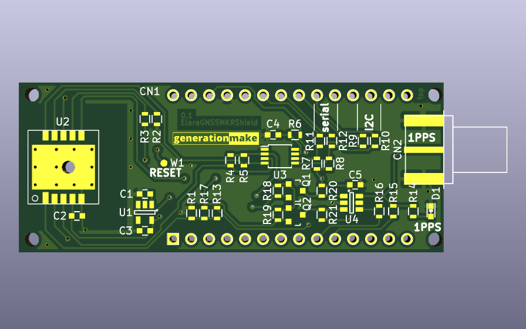
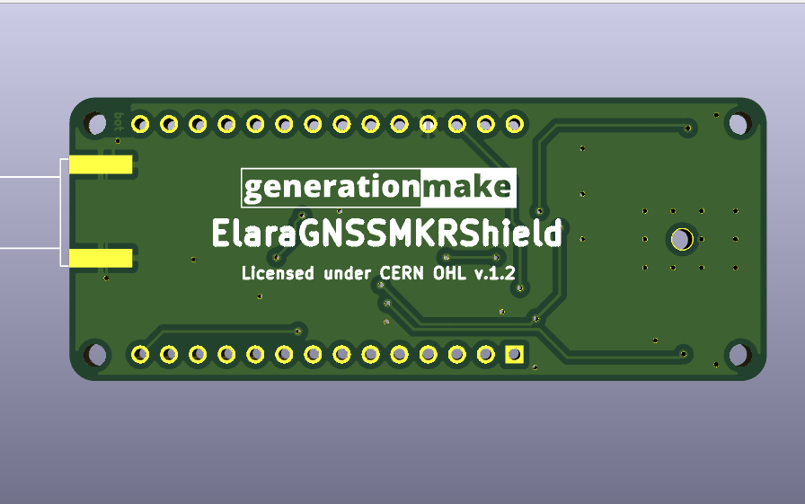

# ElaraGNSSMKRShield
GNSS Shield with Wuerth Elara for Arduino MKR

## PCB

### Top

### Bottom

## Resources

### Datasheets

 * https://www.we-online.de/katalog/de/ELARA-I
 
 ### Arduino Libraries

* [107-Arduino-NMEA-Parser](https://github.com/107-systems/107-Arduino-NMEA-Parser)
