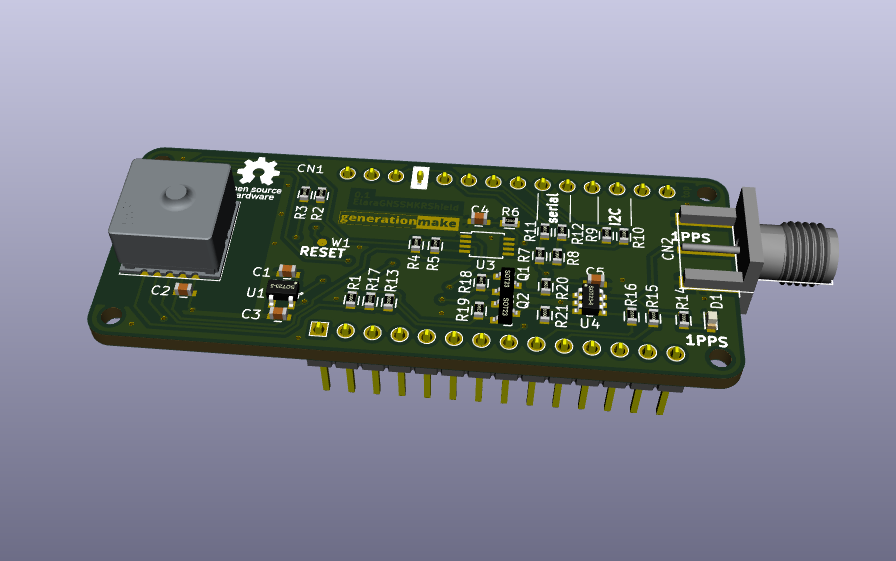
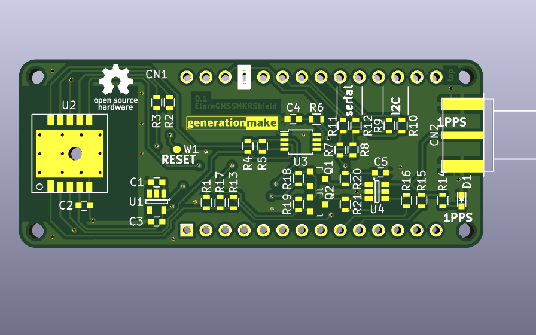

# ElaraGNSSMKRShield
GNSS Shield with Wuerth Elara for Arduino MKR

## pin usage

### Arduino MKR connector CN1

| **Pin** | **Pin Name** | **Signal**    | **Description**                        |
|:-------:|:------------:|:-------------:|:--------------------------------------:|
| 1       | AREF         |               |                                        |
| 2       | DAC0/A0      |               |                                        |
| 3       | A1           |               |                                        |
| 4       | A2           |               |                                        |
| 5       | A3           |               |                                        |
| 6       | A4           |               |                                        |
| 7       | A5           |               |                                        |
| 8       | A6           |               |                                        |
| 9       | 0            | WAKE_UP       | wake signal to Elara GNSS              |
| 10      | 1            | 1PPS          | 1PPS signal from Elara GNSS            |
| 11      | 2            |               |                                        |
| 12      | 3            |               |                                        |
| 13      | 4            |               |                                        |
| 14      | 5            | ON_OFF        | switch Elara GNSS on and off           |
| 15      | 6            |               |                                        |
| 16      | 7            |               |                                        |
| 17      | 8/MOSI       |               |                                        |
| 18      | 9/SCK        |               |                                        |
| 19      | 10/MISO      |               |                                        |
| 20      | 11/SDA       | I2C_SDA       | to Elara GNSS if I2C option is used    |
| 21      | 12/SCL       | I2C_SCL       | to Elara GNSS if I2C option is used    |
| 22      | 13/RX        | SERIAL_RX     | to Elara GNSS if serial option is used |
| 23      | 14/TX        | SERIAL_TX     | to Elara GNSS if serial option is used |
| 24      | RESET        |               |                                        |
| 25      | GND          | GND           |                                        |
| 26      | VCC          | 3V3-rail      | supply voltage for board               |
| 27      | VIN          |               |                                        |
| 28      | 5V0          |               |                                        |

### SMA connector CN2

SMA coax connector.

| **Pin** | **Signal**    | **Description**                  |
|:-------:|:-------------:|:--------------------------------:|
| center  | 1PPS          |                                  |
| shield  | GND           |                                  |
| 3       | I2C_SDA       |                                  |
| 4       | I2C_SCL       |                                  |

## PCB

### Top

### Bottom

## Variants

By default the Elara GNSS is connected via I2C. It is possible to connect to serial.

### BOM changes

The following parts need to be changed:

| part | I2C variant | serial variant |
|:----:|:-----------:|:--------------:|
| R2   | 10k         | DNI            |
| R3   | DNI         | 10k            |
| R9   | 0R          | DNI            |
| R10  | 0R          | DNI            |
| R11  | DNI         | 0R             |
| R12  | DNI         | 0R             |

## Resources

### Datasheets

 * https://www.we-online.de/katalog/de/ELARA-I
 
 ### Arduino Libraries

* [107-Arduino-NMEA-Parser](https://github.com/107-systems/107-Arduino-NMEA-Parser)

## License

This hardware is licensed under the CERN OHL v. 1.2
